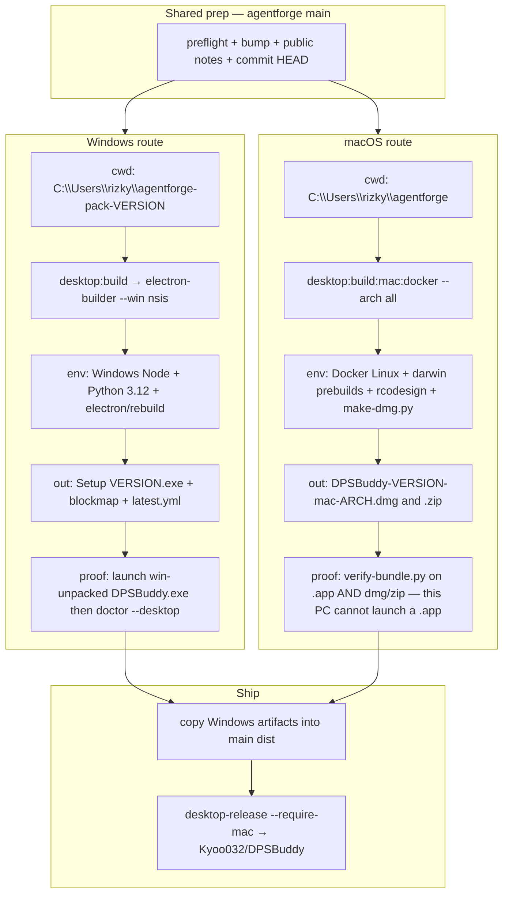
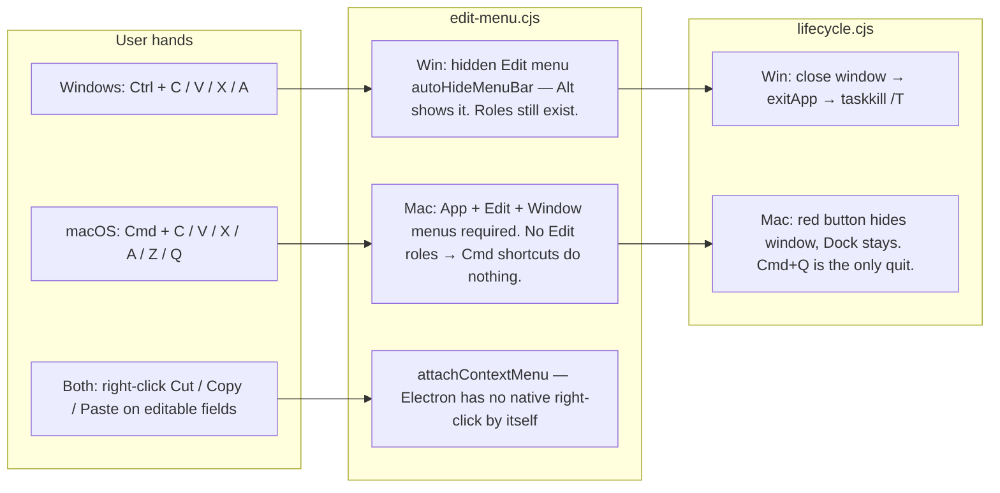

# Pack DPSBuddy (this Windows PC)

Harness, not product. Same class as `verify-agentforge`. Do not vendor into `apps/`, the installer, or the UI.

One Electron shell ships to both OSes. **How it is packed, how the user steers it, and what counts as proof are different.** Canon: [platform/README.md](../../../apps/desktop/platform/README.md), [windows/AGENTS.md](../../../apps/desktop/platform/windows/AGENTS.md), [macos/AGENTS.md](../../../apps/desktop/platform/macos/AGENTS.md). Code: `edit-menu.cjs`, `lifecycle.cjs`. Traps: [traps.md](traps.md).

**Abort** on Cloud. Do not run `desktop:build` or `desktop:build:mac:docker` off this PC.

## How — two pack routes

Never run one command in the other cwd. Never reuse the other route's proof.



| | Windows | macOS |
|---|---|---|
| Cwd | `C:\Users\rizky\agentforge-pack-<version>` | `C:\Users\rizky\agentforge` |
| Command | `npx pnpm@9.15.9 desktop:build` | `npx pnpm@9.15.9 desktop:build:mac:docker --arch all` |
| Forbidden | `desktop:build:mac`, `electron-builder --mac` | `desktop:build` in this cwd, `doctor --desktop` as mac proof |

## How — one shell, two control planes

The renderer never reads `process.platform`. Menus, quit, and shortcuts live in the shell. The 0.14.2 paste bug is the reference: `Menu.setApplicationMenu(null)` looked fine on Windows and killed **Cmd+V** on Mac (and right-click paste everywhere). A menu row is a two-platform change.



## Feature map — controls

These are what a human actually presses. Pack must not drop `edit-menu.cjs` / `lifecycle.cjs` from `app.asar`. Smoke the Windows column on this PC after NSIS/unpacked launch. Mac column is owed on a Mac; Docker cannot prove it.

| Feature | Windows | macOS | Code |
|---|---|---|---|
| Copy | **Ctrl+C** | **Cmd+C** | Edit role `copy` |
| Paste | **Ctrl+V** and **right-click → Paste** (onboarding key field must take both) | **Cmd+V** and **right-click → Paste** | `paste` role + `attachContextMenu` |
| Cut / select all | **Ctrl+X** / **Ctrl+A** | **Cmd+X** / **Cmd+A** | `cut` / `selectAll` |
| Undo | Ctrl+Z (Edit role) | **Cmd+Z** in composer | `undo` |
| Quit | Close the window (whole tree dies, including ffmpeg) | **Cmd+Q** only. Red button ≠ quit | `exitApp` vs `quit` role |
| Reopen | Relaunch the exe | Click Dock icon; Chat returns, no splash once host booted | `reopenTarget` |
| Menu bar | Hidden. **Alt** shows Edit. Never `setApplicationMenu(null)` | Always visible App + Edit + Window | `applicationMenuTemplate` |
| Secrets | Credential Manager `<productName>` / `wrap-key` | Keychain, first prompt **Always Allow** | `wrapKey` |
| userData | `%APPDATA%\DPSBuddy` | `~/Library/Application Support/DPSBuddy` | `applyProductPaths` |
| Updates | Check for updates → `latest.yml` | Panel says download the `.dmg`; Check disabled. No `latest-mac.yml` | `auto-update.cjs` |
| GPU | Hardware acceleration **off** | **on** | `main.cjs` |
| Install | NSIS `DPSBuddy Setup <v>.exe` | Drag `.dmg` to Applications; Gatekeeper Open Anyway | `package.json` `build` |

Windows smoke after a shell change: [windows/AGENTS.md](../../../apps/desktop/platform/windows/AGENTS.md) (Ctrl+V **and** right-click Paste, composer round-trip, close kills the tree). Mac smoke: [macos/AGENTS.md](../../../apps/desktop/platform/macos/AGENTS.md) (Cmd+V **and** right-click, Dock reopen, Cmd+Q).

## Checklist

```
- [ ] preflight
- [ ] rebase onto origin/main; bump; public notes; commit; push (if Kyo asked to ship)
- [ ] Windows worktree pack + doctor --desktop
- [ ] macOS Docker pack + verify-bundle in that log
- [ ] copy Windows artifacts into main dist; dry-run --require-mac
- [ ] desktop:release --require-mac (only when Kyo asked to ship)
- [ ] record in docs/internal; push
```

Both platforms unless Kyo says Windows-only. Mac stays labelled **preview**.

## 0. Preflight

```powershell
Remove-Item Env:ELECTRON_RUN_AS_NODE -ErrorAction SilentlyContinue
$env:PYTHON = "$env:LOCALAPPDATA\Programs\Python\Python312\python.exe"
$env:npm_config_python = $env:PYTHON
node .cursor/skills/pack-dpsbuddy/scripts/preflight.mjs
```

Use `npx pnpm@9.15.9` (corepack EPERM on this box).

## 1. Prep (source stays on agentforge)

1. `git fetch origin` and rebase the bump onto `origin/main`.
2. Ship list: current `docs/internal/0.14.2x-changelog.md`. Next version `0.14.26+` — never `0.14.3+`, never `0.15` unless Kyo says so.
3. Bump only `apps/desktop/package.json` `version`.
4. Write `docs/public/<version>-notes.md`. Mac notes use **DPSBuddy** names, Gatekeeper, Keychain, **Cmd** shortcuts, manual updates.
5. Point `AGENTS.md` ship list at that patch.
6. Commit. Docker packs **HEAD**.

## 2. Windows env (worktree only)

```powershell
$v = (Get-Content apps/desktop/package.json | ConvertFrom-Json).version
$pack = "C:\Users\rizky\agentforge-pack-$v"
$sha = git rev-parse HEAD
git worktree add --detach $pack $sha
# copy gitignored media from this checkout into $pack\apps\desktop\resources\...
cd $pack
# PYTHON + npm_config_python + unset ELECTRON_RUN_AS_NODE (same as §0)
npx pnpm@9.15.9 install --frozen-lockfile
npx pnpm@9.15.9 desktop:build
```

**Windows feedback:** exe + blockmap + `latest.yml`; grep `host.cjs`; launch `dist\win-unpacked\DPSBuddy.exe`; `doctor.mjs --desktop` from **main** checkout (`transport: "ipc"`). If a shell/menu file changed: Ctrl+V **and** right-click Paste on the key field. NSIS `/S` hangs — [traps.md](traps.md).

## 3. macOS env (main checkout + Docker Linux only)

Stay in `C:\Users\rizky\agentforge`. Do not pin Windows Python.

```powershell
Remove-Item Env:ELECTRON_RUN_AS_NODE -ErrorAction SilentlyContinue
npx pnpm@9.15.9 desktop:build:mac:docker --arch all
```

Never `electron-builder --mac` on this host.

**macOS feedback:** per-arch `verify: all checks passed` for `.app` **and** `--dmg --zip`. Static only. Cmd+C/V and Dock reopen are **not** proven here.

## 4. Combine + release

Copy `DPSBuddy Setup <v>.exe`, `.blockmap`, and `latest.yml` from the **worktree** dist into main `apps/desktop/dist/`.

```powershell
npx pnpm@9.15.9 --filter @agentforge/desktop exec node scripts/release-desktop.mjs --require-mac --dry-run
npx pnpm@9.15.9 --filter @agentforge/desktop exec node scripts/release-desktop.mjs --require-mac
```

Never upload `latest-mac.yml`. Do not `git push` source to DPSBuddy.

## Do not

- Run `desktop:build` and `desktop:build:mac:docker` in the same cwd
- Teach the UI Ctrl vs Cmd in `apps/web` — shortcuts come from Electron **roles**
- `Menu.setApplicationMenu(null)`
- Copy Windows `taskkill` quit onto darwin
- Claim mac launched because Docker exited 0
- Doctor `:3000` as the installer
