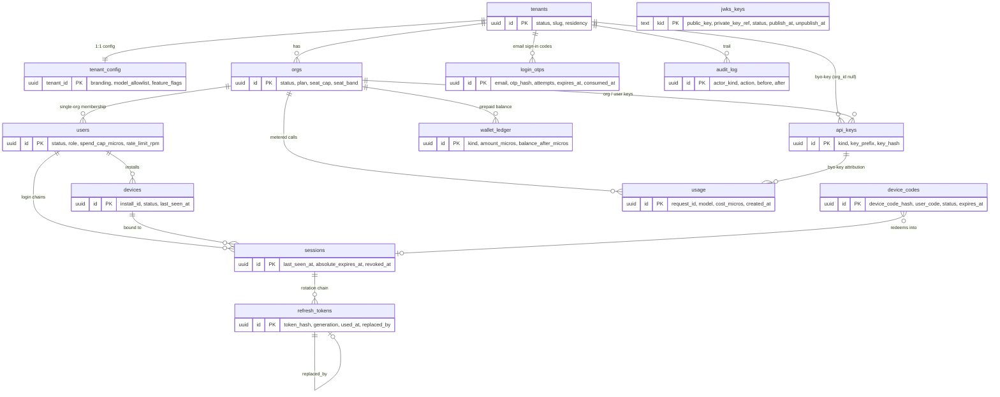

# Toko Token AI portal — control-plane database design

Status: design, for the backend team implementing `api.tokotokenai.com`.
Target: one PostgreSQL 16 instance on TencentDB (Jakarta). Migrations live in `migrations/`.
Companion doc: `device-code-login.md` (the login flow that calls this schema).

The portal is the control plane. The desktop client (`DPSBuddy`) is a thin client: it holds no
licence state, makes no entitlement decision, and stores only an `install_id` and a refresh token.
Every gate — seats, plan, spend, model allowlist — is a row in this database.

---

## 1. ERD



---

## 2. Table-by-table rationale

### `tenants`
The whitelabel partner: Toko Token itself, JAST, Hypernet, Metranet. It is the root of every RLS
scope, so it is the only table whose policy keys on `id` rather than `tenant_id`.
`status` drives `tenant_inactive`. `slug` doubles as the suffix of the per-tenant DB role
(`tenant_jast`) and must therefore match `^[a-z][a-z0-9_]{1,30}$`. `residency` records where the
data must live; `dedicated` marks a tenant that has been moved to its own instance (the Enterprise
upsell) and is informational on this instance.

### `tenant_config`
1:1 with `tenants`, holding `branding`, `model_allowlist` and `feature_flags` as `jsonb`.
Split out rather than added as three columns on `tenants` because it is fetched on **every** login
(read-mostly, cacheable, safe to replicate) and edited by a different actor than `tenants.status`;
keeping the blobs off the hot auth row avoids TOAST churn on the one table every request touches.
`version` is bumped on write so the client can be told "unchanged".

### `orgs`
The billing and seat boundary inside a tenant. Carries `status` (`active | past_due | suspended`
→ `org_past_due` / `org_inactive`), `plan`, `seat_cap` (hard ceiling on active users; free tier
ships at 20), `seat_band` (the contracted graduated band used for invoicing, always ≥ `seat_cap`),
`currency`, and the org-level defaults `default_spend_cap_micros` / `default_rate_limit_rpm` that
users inherit when their own field is NULL.

**Plan gates are columns and flags, not tables.** The flag vocabulary is exactly:

| flag | shape | meaning |
|------|-------|---------|
| `admin_console` | boolean | the org admin UI |
| `usage_reports` | boolean | usage reporting beyond the current balance |
| `audit_export` | boolean | export of `audit_log` |
| `spend_caps` | boolean | per-user spend caps are enforceable |
| `model_allowlist` | boolean | `tenant_config.model_allowlist` is enforced |
| `sentinel_filtering` | boolean | Sentinel content filtering |
| `residency` | boolean | contractual data residency |
| `allow_byo_key` | boolean | a pasted gateway key may be used on this tenant; `false` makes the client fall through to the session token |
| `sso_provider` | text or null | **the one non-boolean flag.** `null` = no SSO; a string names the tenant's OIDC provider, which `/activate` redirects to instead of rendering the OTP form |

There is deliberately no boolean `sso`: `sso_provider IS NOT NULL` *is* the gate, so the flag that
turns SSO on and the flag that says which provider cannot drift apart.

These live in `tenant_config.feature_flags` (tenant-wide) narrowed by `orgs.feature_flags` (per
org), with `plan` as the default source. They are read on every login and never joined or aggregated
against, so a normalised `entitlements` table would buy nothing and cost a join on the hottest path.

### `users`
**Single-org, deliberately.** No `org_memberships` table. The access token carries exactly one
`oid`; seat counting and the per-user spend cap are both per-org; and the device-code flow has no
screen on which to choose an org. A person who genuinely needs two orgs gets two user rows.
If multi-org is ever required, add `org_memberships(user_id, org_id, role)` and demote
`users.org_id` to "default org" — nothing else changes, because every other table already carries
`org_id` explicitly rather than deriving it through the user.
`status` (`invited | active | disabled`) drives `user_inactive`. `spend_cap_micros` +
`spend_window` and `rate_limit_rpm` are what the gateway reads on every `/v1` call.

### `devices`
One install, bound to one user, identified by a client-generated `install_id` persisted in
`settings.enc` (AES-256-GCM, wrapped by a keytar secret in Windows Credential Manager / macOS
Keychain — `apps/desktop/main.cjs:168-184`). The client has no device id today; the login flow
introduces it. `status = 'revoked'` → `device_revoked`, and revoking a device cascades to its
sessions. `last_seen_at` gives support a "which machines is this person on" view.

### `sessions`
One login chain = user + device. Its id is the `sid` claim. `last_seen_at` is the seat-counting
signal. `absolute_expires_at` is the hard 90-day ceiling that the sliding 30-day refresh TTL may
never exceed. `revoked_at`/`revoked_reason` give support and forensics the *why*, using the same
reason-code vocabulary the API returns.

### `refresh_tokens`
The rotation chain under a session. Raw token = 32 random bytes base64url, kept only in the OS
keychain; the DB stores `token_hash = sha256(raw)` (32 bytes, enforced by a CHECK). `generation`
counts rotations, `used_at` marks a spent token, `replaced_by` links to the successor. Presenting a
row with `used_at IS NOT NULL` is reuse: the entire chain and the session are revoked and the
caller gets `refresh_reused`. The unique index on `token_hash` is the lookup path.

### `device_codes`
Pending device authorizations. `device_code` is 32 random bytes stored as sha256; `user_code` is 8
characters from `ABCDEFGHJKLMNPQRSTUVWXYZ23456789` (no `0/O/1/I`) formatted `XXXX-XXXX`; TTL 10
minutes; poll interval 5 s in `interval_seconds`, with `last_polled_at` driving `slow_down`.
Statuses map to `authorization_pending`, `device_code_expired`, `device_code_denied`.

This is the **only** table where `tenant_id` is nullable: the code is minted before anyone has
authenticated, so the tenant is unknown until the browser half approves. It is contained by
grants, not by nullability — `tenant_readonly` has no privilege on the table at all, and the RLS
policy exposes the NULL window only to `portal_app`. Lookups are by a 32-byte hash or by a live
`user_code` under a partial unique index, so the code space recycles instead of exhausting.

### `login_otps`
The browser half of the login has no password to check, so it checks a mailed one-time code
instead: 6 digits, 10-minute TTL, 5 verify attempts, single use, 3 sends per 15 minutes per
address. The reason there is no password column anywhere in this schema is in `device-code-login.md`
("Sign-in method"); the short version is that a password database for four whitelabel partners with
no shared IdP is the worst asset we could choose to hold.

Only `otp_hash = sha256(code)` is stored, never the code — for ten minutes a row here is
password-equivalent, so a dump of the table must not sign anyone in. `attempts` is capped at 5 by a
CHECK and `consumed_at` is set in the same transaction that signs the user in, which is what makes
the code single-use rather than merely short-lived.

The **send** limit is counted from the rows themselves: "how many codes went to this address since
`now() - 15 minutes`" is a bounded range scan on `ix_login_otps_tenant_email (tenant_id, email,
created_at DESC)`, the same index that finds the newest live code at verify time. No counter column,
so nothing to reconcile — but it does mean the pruning job must not delete inside the send window,
which is why `prune_login_otps()` keeps 24 hours rather than deleting on consumption.

`tenant_id` is NOT NULL here, unlike `device_codes`. A code is only minted after `/activate` has
resolved a tenant from the device code's `tenant_hint`, so this table never holds a
pre-authentication NULL window. The open edge is the generic (unbranded) build, where there is no
`tenant_hint`: resolving the tenant from the e-mail address means reading `users` across tenants,
which `portal_app` cannot do — RLS fails closed without `app.tenant_id`. That path needs a
`portal_admin`-owned `SECURITY DEFINER` resolver returning at most a tenant id, and it is not in
`0005_functions.sql` yet. Flagged in `device-code-login.md`, `GET /activate`.

### `jwks_keys`
The Ed25519 keys that sign access tokens, served at `/.well-known/jwks.json`. `kid` is the primary
key and the JWT header value; `public_key` is the raw 32-byte key; `private_key_ref` is a pointer
into the KMS / secret manager, **never** the private key — so a dump of this table, or a nightly
export that somehow reached it, signs nothing.

**This table is not tenant-scoped, and it is the only table excluded from RLS.** One key set signs
every tenant's tokens, and the gateway verifies a signature *before* it has parsed a `tid` claim, so
a tenant predicate would be unsatisfiable on the only path that reads the table — RLS here would buy
no isolation and fail closed on every request. The exclusion is written out in `0004_rls.sql` so it
reads as a decision rather than an omission. Isolation is by grant instead: `SELECT` to `portal_app`,
nothing to `tenant_readonly`, and rotation performed as `portal_admin`.

`status` is `active | next | retired`, with one `active` key enforced by a partial unique index.
The two published-but-not-signing windows are columns, because the gateway's JWKS cache is an hour
stale by design: `publish_at` puts a `next` key into the document 24 h before it may sign, and
`unpublish_at` keeps a `retired` key in it for 24 h after it stops. So the document is exactly
`WHERE publish_at <= now() AND (unpublish_at IS NULL OR unpublish_at > now())`, and a gateway never
meets an unknown `kid` nor rejects a token signed by the key being replaced. Cadence is 90 days; on
suspected compromise `unpublish_at` is set to `retired_at` and the key leaves the document at once.

### `api_keys`
Three shapes discriminated by `kind`, enforced by one CHECK:

| kind | org_id | user_id | meaning |
|------|--------|---------|---------|
| `tenant` | NULL | NULL | **BYO-key door**: user pastes a raw gateway key. No org, no seat, no support. |
| `org` | set | NULL | server-to-server key owned by an org |
| `user` | set | set | key issued to one member |

The `tenant` shape is what backs the Bearer-key calls the client already makes today
(`GET /api/pricing`, `GET /api/usage/token`, `/v1/models`, 3 s/5 s timeouts) — those endpoints keep
working unchanged. `key_prefix` is the non-secret display prefix; `key_hash` is sha256 of the raw
key, shown once at creation.

### `wallet_ledger`
Append-only prepaid wallet, one row per money movement. `amount_micros` is signed micro-USD with
the sign fixed per `kind` by a CHECK (`topup`/`refund` > 0, `charge` < 0). `balance_after_micros`
is denormalised so the gateway never SUMs the table. `idempotency_key` is unique per org so a
replayed payment webhook cannot double-credit. Corrections are new `adjustment` rows, never an
UPDATE — a trigger enforces that for every role including the owner.

### `usage`
The immutable metering row: `request_id`, `model`, `prompt_tokens`, `completion_tokens`,
`cost_micros`, `org_id`, `user_id`, `device_id`, `api_key_id` (nullable, set on the BYO-key path),
`created_at`. A CHECK requires `org_id IS NOT NULL OR api_key_id IS NOT NULL` — an org-less row is
only legal when a tenant-owned key is paying. Immutability is a BEFORE UPDATE/DELETE trigger *and*
a withheld grant, so an accidental privilege grant is not enough to rewrite billing evidence.

### `audit_log`
Append-only administrative and security trail with `before`/`after` as `jsonb` and an actor that is
one of `user | api_key | system | support`. Every denied auth attempt writes a row carrying the
`reason_code`; every seat, plan, key and revocation change writes the before/after pair. This is
what "audit export" (a Business/Enterprise gate) reads.

---

## 3. RLS and the role model

Every tenant-scoped table gets:

```sql
ALTER TABLE t ENABLE ROW LEVEL SECURITY;
ALTER TABLE t FORCE  ROW LEVEL SECURITY;
CREATE POLICY p_t_tenant ON t FOR ALL
  USING (tenant_id = app_tenant_id()) WITH CHECK (tenant_id = app_tenant_id());
```

Two tables sit outside that shape, both deliberately. `device_codes` is tenant-scoped but its
`tenant_id` is nullable until approval, so it carries a `portal_app`-only policy that exposes the
NULL window and nothing else. `jwks_keys` is not tenant-scoped at all and is the **only** table with
no RLS: one key set signs every tenant's tokens and the gateway verifies a signature before it has a
`tid`, so a tenant predicate would fail closed on every request while protecting nothing. Both
exclusions are written out in `0004_rls.sql`; anything added later must pick one of these three
shapes explicitly.

`app_tenant_id()` is `nullif(current_setting('app.tenant_id', true), '')::uuid` — the `true`
argument makes an unset GUC return NULL instead of raising, and a NULL comparison makes the policy
false, so the system **fails closed**. `FORCE` matters: without it the table owner silently
bypasses the policy, which is exactly the account a migration or a debugging psql session uses.

| Role | Login | Purpose |
|------|-------|---------|
| `portal_admin` | no | owns every object, runs migrations, back office. `BYPASSRLS` where the managed instance allows it; an explicit `USING (true)` policy covers the case where it does not. |
| `portal_app` | via a login member | the **only** role the portal API and the `/v1` gateway use. Serves all tenants. |
| `tenant_readonly` | no | group role holding the read-only grant set. |
| `tenant_<slug>` | yes | one per partner, `INHERIT`s `tenant_readonly`, pinned with `ALTER ROLE … SET app.tenant_id`. |

**How the gateway scopes a request.** `portal_app` uses one connection pool for all tenants, so the
scope must not survive a checkout:

```sql
BEGIN;
SET LOCAL app.tenant_id = '…';   -- from the verified JWT `tid` claim
-- spend-cap read, rate-limit read, usage INSERT, wallet append
COMMIT;
```

`SET LOCAL` is mandatory — it is rolled back with the transaction. A plain `SET` on a pooled
connection leaks the previous tenant's scope into the next request and is the single most likely
way to breach isolation here; it belongs in the code-review checklist and in a pooler-level test.
Note this also rules out running these queries outside a transaction, and rules out a transaction
pooler mode that can move statements between connections mid-transaction.

**Per-tenant connection string, from day one.** `create_tenant_role('jast', <uuid>, <secret>)`
creates `tenant_jast` with `app.tenant_id` pinned at the role level, so the DSN alone is scoped —
no application code involved. It is read-only and column-restricted: `key_hash` on `api_keys` is
not granted, and `refresh_tokens` / `device_codes` are not granted at all. This is what makes the
later move of one tenant to a dedicated instance a data migration rather than a redesign.

**Nightly per-tenant exports.** A scheduled job connects once per tenant with that tenant's DSN and
runs `\copy (SELECT …) TO PROGRAM 'gzip > …'` for `orgs, users, devices, sessions, wallet_ledger,
usage, audit_log` (plus the non-secret `api_keys` columns). Because the connection is already
RLS-scoped, the export query needs no `WHERE tenant_id = …` and cannot accidentally omit one — a
forgotten predicate returns zero rows rather than everyone's. Output goes to per-tenant object
storage in Jakarta, encrypted, retained per the tenant's contract.

---

## 4. Partitioning, maintenance and retention

`usage` is declaratively range-partitioned by month on `created_at` from day one, because it is the
only unbounded table and retention is expressed in months. The primary key is `(id, created_at)` —
Postgres requires the partition key in every unique index, which is also why the request-idempotency
index is `(tenant_id, request_id, created_at)`.

- Migration 0003 creates `usage_y2026m09`, `usage_y2026m10`, `usage_y2026m11` and `usage_default`.
- `ensure_usage_partitions(3)` runs nightly from an external scheduler (`pg_cron` is not guaranteed
  on TencentDB) and creates this month plus three ahead — idempotent, so a missed night is harmless.
- `create_usage_partition()` calls `secure_usage_partition()`, which enables and forces RLS,
  installs the tenant policy and grants on the new partition. A policy on the parent only covers
  access *through* the parent; a direct `SELECT` on a partition uses that partition's own RLS.
- `usage_default` must stay empty (it only catches clock-skewed timestamps). Alert on
  `count(*) > 0`: while it holds rows, attaching a covering range takes `ACCESS EXCLUSIVE` and
  scans it.
- Retention: keep 25 months hot (two full years plus the current month, so year-on-year reports
  work). Monthly, `ALTER TABLE usage DETACH PARTITION usage_yXXXXmYY CONCURRENTLY;` then archive
  and drop. Detach is metadata-only; the archive must exist before the drop.
- `wallet_ledger` and `audit_log` are not partitioned — they grow with events, not with requests.
  Revisit `audit_log` if it passes ~50M rows; the same monthly scheme applies.
- `device_codes` is pruned by `expire_device_codes()` every minute; expired refresh tokens are
  deleted 30 days past `expires_at`. `login_otps` is pruned by `prune_login_otps()` hourly, which
  keeps 24 hours rather than deleting on consumption — the 3-sends-per-15-minutes limit counts the
  rows, so pruning inside that window would hand the sender a fresh budget.
- `jwks_keys` is never pruned automatically. A retired key row outlives its `unpublish_at` on
  purpose: it is the record of which `kid` signed what, and it is a handful of rows per decade.

---

## 5. The seat count

"Active user" = `status = 'active'` **and** at least one non-revoked session seen in the last 30
days.

```sql
SELECT count(*)::integer
FROM users u
WHERE u.org_id = $1
  AND u.status = 'active'
  AND EXISTS (
    SELECT 1 FROM sessions s
    WHERE s.user_id = u.id
      AND s.revoked_at IS NULL
      AND s.last_seen_at > now() - interval '30 days'
  );
```

Two partial indexes make it cheap:

```sql
CREATE INDEX ix_users_org_active   ON users (org_id) WHERE status = 'active';
CREATE INDEX ix_sessions_user_live ON sessions (user_id, last_seen_at DESC) WHERE revoked_at IS NULL;
```

The outer scan touches only active users of one org; the `EXISTS` stops at the first index tuple
per user. At 1000 seats this is a sub-millisecond plan.

**Atomicity.** `login_precheck()` takes `pg_advisory_xact_lock(hashtextextended(org_id::text, 0))`
before counting, and the caller inserts the new session in the same transaction — so two logins
racing at the cap cannot both pass. An advisory lock beats a counter column here because the
predicate is *time-based*: a stored counter would drift as sessions age out of the 30-day window
and would need a reconciler. The lock is held for microseconds and only on the new-session path —
`login_precheck` skips the seat check entirely when a `session_id` is passed, because a refresh
cannot grow the active set (the 30-day sliding refresh TTL means anything still able to refresh was
already inside the window and already counted).

---

## 6. Wallet concurrency

Balance = `balance_after_micros` of the org's highest `seq` row, one index fetch on
`ix_wallet_ledger_org_seq (org_id, seq DESC)`.

The concurrency rule is a **row lock on `orgs`**: `append_wallet_entry()` does
`SELECT … FROM orgs WHERE id = $1 FOR UPDATE` first, which serializes every append for that org, so
"read latest balance → add → insert" is atomic without `SERIALIZABLE` and without a lock table.
Orgs are the natural lock object because a wallet belongs to exactly one. Lock ordering is always
`orgs → wallet_ledger`, everywhere, which makes deadlock impossible. Replays of an existing
`(org_id, idempotency_key)` write nothing and return the existing row with `deduped = true`.

A negative balance is *allowed* to be written: the gateway meters after the fact, so a burst can
land a charge that overdraws by a few cents, and refusing the insert would lose the metering
record. The soft floor — stop admitting new requests below zero — is a gateway decision, not a
ledger constraint.

---

## 7. Open questions

1. **Does the free tier's seat cap need to be enforced at 20, or only billed?** Today `seat_cap`
   defaults to 20 and blocks the 21st login with `seat_cap_reached`. Sales may prefer a soft cap
   that admits the user and raises an invoice.
2. **Seat reclamation.** A user who stops logging in frees a seat after 30 days of session
   inactivity, silently. Do admins need an explicit "deactivate" step, and should they be notified
   before the seat is reclaimed?
3. **`request_id` uniqueness across a month boundary.** The idempotency index includes
   `created_at`; a retry that crosses midnight on the 1st can insert twice. Acceptable, or do we
   need a separate dedupe key with a bounded window?
4. **Spend cap window.** `users.spend_window` is `day | month` with no timezone column. Jakarta
   (UTC+7) or UTC? Per-tenant or global?
5. **IDR.** `orgs.currency` allows IDR but `cost_micros` and the whole ledger are micro-USD. Do we
   hold the FX rate per ledger entry, or convert only at invoice time?
6. **SSO and `users.external_subject`.** One IdP per tenant, or per org? The unique index is
   currently `(tenant_id, external_subject)`.
7. **BYO-key metering and the wallet — unresolved; nothing may assume an answer.**
   `wallet_ledger.org_id` is NOT NULL and there is no per-user wallet, so BYO-key spend cannot land
   on "the user's own wallet" anywhere in this database; `usage` rows on that path carry
   `api_key_id` and no `org_id`, so they cannot charge a wallet either. Two candidate answers:
   (a) **billed entirely outside this database** — the pasted key's own upstream billing
   relationship pays, and `usage` rows are kept as evidence only; or (b) **a shadow org per BYO
   user** — one org row per BYO user, which gives the path a wallet and a ledger at the cost of a
   seat-counting and support-boundary question. Until this is decided, neither the login flow nor
   the client may state where BYO spend lands. Mirrored in `device-code-login.md`, open question 9.
8. **Audit retention vs. privacy.** `audit_log` keeps IPs and user agents indefinitely. What is the
   retention, and does a tenant deletion request have to reach it?
9. **Dedicated-instance cutover.** `tenants.residency = 'dedicated'` is informational. Who owns the
   move, and does the shared instance keep a tombstone row or delete the tenant outright?
10. **Gateway `last_seen_at` writes.** Touching `sessions.last_seen_at` on every `/v1` call would
    make it the hottest write in the system. Proposed: debounce to once per 15 minutes per session.
    Needs sign-off, because it is what the seat definition rests on.
