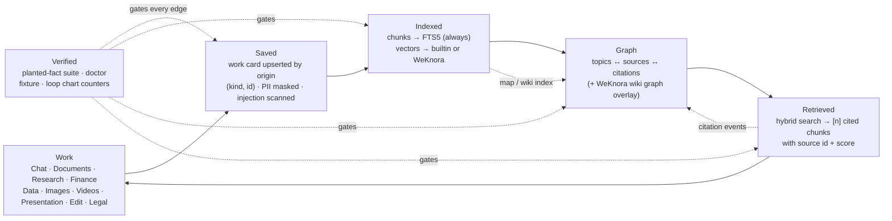
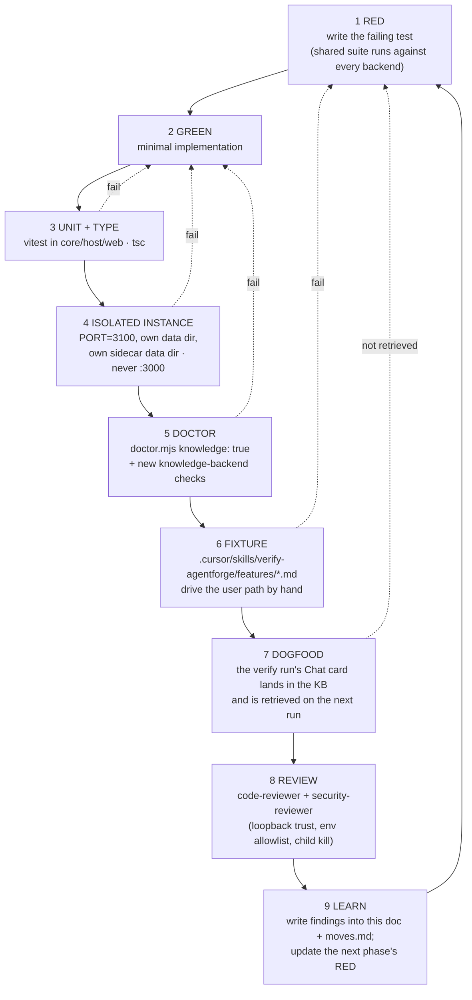

# WeKnora as the knowledge-base backend — evaluation and plan

Date 2026-09-10 · Status: approved by owner 2026-09-10; Phases 0–1 landed the same day (see Progress log), Phase 2 next, Phase 3 gated on the spikes · Scope: knowledge subsystem only.
Evaluated: Tencent/WeKnora v0.8.0 (main tip 5db13a1), MIT. Owner asked for it; this is the engineering shape.

## What WeKnora gives us (lite mode)

- Single Go binary (`make build-lite`, CGO + `-tags sqlite_fts5`). No Redis, MinIO, Neo4j, or sandbox needed.
- Real hybrid retrieval on SQLite: sqlite-vec `vec0` KNN + FTS5 bm25 (bigram, CJK-aware) fused with RRF; rerank optional and skipped when unset.
- Browserless single-user bootstrap: `POST /api/v1/auth/auto-setup` (lite-only) creates the admin tenant and returns a JWT; exchange for a long-lived key via `POST /tenants/:id/api-keys`.
- Models are per-tenant DB rows with arbitrary OpenAI-compatible `base_url` + AES-encrypted `api_key` + custom headers. Toko Token drops straight in; Ollama first-class.
- Go-native chunking (`auto|heading|heuristic|recursive`, overlap, parent/child), MD5 dedupe, reparse, stage DAG, chunk-level `score` / `knowledge_id` / `chunk_index` in results.
- **Wiki graph without Neo4j.** `GET /knowledgebase/:kb_id/wiki/graph` returns `{nodes[{slug,title,page_type,link_count}], edges[{source,target}], meta}` computed purely from wiki page in/out links (`internal/application/service/wiki_page.go:576`). Pages are LLM-generated from the KB by `wiki/index`. Works in lite.
- `cmd/desktop` (Wails) proves the sidecar shape: Gin on `127.0.0.1:0`, per-user data dir, NSIS + DMG in upstream CI.

## Hard problems

1. **No PDF/DOCX in the default lite build.** The in-process `simple` engine parses md/txt/csv/json/images/audio only. PDF/Office need either the Python `docreader` gRPC service (LibreOffice + JRE + Playwright in the image) or `-tags anydoc` (Rust static lib, per-platform, no Windows-arm64). Decision: parse in Node and push Markdown to `/knowledge/manual`.
2. **CGO is mandatory**, so no cross-compile. Upstream ships no headless Windows lite binary; we own Windows + mac-arm64 build lanes. This machine has no Go, Rust, or gcc (VS 2022 present, but CGO wants MinGW gcc).
3. **Offline violation out of the box**: DuckDB runs `INSTALL spatial; INSTALL excel;` against extensions.duckdb.org at startup unless `DUCKDB_SKIP_EXTENSION_LOAD=1`, which `.env.lite.example` omits.
4. **Weight**: ~347 Go deps, statically linked DuckDB and every vector-DB client compiled in even for lite. Expect 100 MB+ binary.
5. `migrations/sqlite/` is loaded from disk relative to CWD, not embedded. Installer layout and spawn cwd are load-bearing.
6. Breaking changes every 2–4 weeks (0.8.0 removed the sandbox backend, 0.7.x removed Neo4j memory). REST paths are fairly stable; DTO/config shapes are not.
7. **Graph RAG proper (entity extraction) is Neo4j-gated** (`extract.go:100`, `initialization.go:663` returns 400). Out of scope. The wiki page-link graph is the graph we use.

## What our KB actually is today (why "replace" beats "augment")

- Retrieval is vector-OR-FTS fallback, not hybrid; vectors are JSON arrays scanned with JS cosine on the event loop; FTS has no `ORDER BY bm25()`.
- 800-char fixed stride, zero overlap. PDF/DOCX rejected with a 400 even though `readDocx` already exists in `packages/core/src/docx`.
- `retrieveChunks` returns bodies only — no source ids, no scores — so the default Soul rule "cite a source" is unsatisfiable.
- Embedding failure silently stores 32-dim stub vectors under the real model id.
- The knowledge map (`topics[{title, summary, sourceIds, verdict}]`) is a JSON blob regenerated on demand and never consulted at retrieval time. It is already a proto-graph: topic → source edges.
- The loop chart (`apps/web/lib/knowledge-loop.ts`) shows `Work → Saved → Indexed → Retrieved` but the **Retrieved** stage is not measured: nothing records which sources a Chat run actually pulled.
- No test asserts a planted fact is retrieved.
- Soul, memories, knowledge map, settings, and the work-cards→KB origin idempotency + cascade delete are agentforge-only and must stay in our SQLite.

## Options considered

- **A. Bundled sidecar** — right end state, blocked on the Windows CGO lane and footprint.
- **B. Optional external server** — safe but dead on arrival for the owner's goal; also widens the loopback trust boundary.
- **C. Port the ideas into TS** (sqlite-vec extension, bm25 + RRF, overlap chunker, chunk ids, Node PDF/DOCX) — 8–12 dev days, does not satisfy the ask.
- **D. Adapter first, sidecar second — RECOMMENDED.**

## Recommendation: D

Architectural line: **WeKnora is a retrieval engine, never a system of record.** `knowledge_sources` (origin_kind/origin_id), soul, memories, map, graph, settings stay in agentforge SQLite; FTS5 is dual-written on every ingest. WeKnora owns vectors, hybrid scoring, and (when on) the wiki graph. Rollback is a flag flip; `GET /api/v1/knowledge` is unchanged; retrieval survives a dead sidecar.

## The loop

Two loops run through this plan. The **product loop** is what the user sees on the Knowledge page. The **delivery loop** is how every phase is built and proven. Each phase below states which edge of the product loop it strengthens and runs the full delivery loop before it is called done.

### Product loop (what the Knowledge page shows)



Plain-text version for terminals:

```
 Work ──▶ Saved ──▶ Indexed ──▶ Graph ──▶ Retrieved ──▶ Work
  ▲                    │           ▲          │
  │                    └─ map/wiki ┘          │
  │                                citations  │
  └───────────── Verified gates every edge ◀──┘
```

The loop chart gains two stages: **Graph** (nodes/edges count) and **Verified** (last planted-fact run: pass/fail + time). `LOOP_STAGES` becomes `["Work", "Saved", "Indexed", "Graph", "Retrieved", "Verified"]`.

### Delivery loop (how each phase ships)



Step 7 is the point: every phase must prove itself **through the product loop**, not beside it. The verification run is itself Work; its card must be Saved, Indexed, Graphed, and Retrieved on the next Chat turn on the :3100 instance.

## Phases

Each phase has the same six blocks: Goal · Work · Loop edge · Graph · Verify · Exit.

### Phase 0 — seam, citations, measured retrieval (no WeKnora)

**Goal.** One retrieval interface, chunks carry identity and score, and the Retrieved stage becomes measurable.

**Work.**
- `packages/host/src/knowledge/backend.ts`: `KnowledgeBackend { indexSource, deleteSource, retrieve, health }`; `retrieve` returns `{ body, sourceId, sourceName, score, chunkIndex }[]`.
- Extract `SqliteBuiltinBackend` from `knowledge.ts` unchanged in behavior; add `ORDER BY bm25(knowledge_chunks)` to the FTS path.
- `retrieveChunks` returns chunks, not bodies. `knowledgeInjection` keeps `{prompt, parts[3]}` but every `[n]` is rendered `[n] <sourceName>` so the default Soul rule "cite a source" is satisfiable.
- New table `knowledge_retrievals (id, workspace_id, thread_id, run_id, source_id, chunk_index, score, backend, created_at)` (migration 0010 + `ensure-schema.ts` mirror; 0009 is the market cache). `runs.ts` writes one row per injected chunk after the run completes. This is the Retrieved counter and the first graph edge type.
- Shared suite `packages/host/src/knowledge/backend.contract.test.ts` parameterized over backends: plant a fact, index, retrieve, assert `sourceId` and `score > 0`; delete, assert gone; origin upsert twice, assert one source.

**Loop edge.** Retrieved → Work. Before this phase the edge is asserted; after it, it is counted.

**Graph.** Persist `retrieval` edges (source → thread). No UI yet.

**Verify.**
- Unit: contract suite green for `builtin`; existing 28 knowledge tests still green; `market/repo.ts` still compiles against `knowledgeFtsQuery`.
- Isolated: on :3100 paste a source containing a unique token, ask Chat about it, open the context popover → `parts[2].detail` shows `1 chunks · fts`, and the reply cites `[1] <name>`.
- Doctor: `knowledge: true` unchanged; add `knowledgeRetrievals >= 1` after the Chat step.
- Fixture: extend `features/knowledge.md` "Driving it" with the planted-fact recipe; it replaces the vague `N chunks · rag or fts` line.
- Dogfood: the Chat turn above is itself a work card; on the next turn, ask "what did we just verify" → the card is retrieved.

**Exit.** Contract suite exists and passes; `knowledge_retrievals` populated on :3100; fixture updated; code-review pass.

### Phase 1 — Node parsing (PDF / DOCX)

**Goal.** Saved → Indexed stops rejecting real documents. Same code serves builtin and WeKnora.

**Work.**
- `extractText` (`knowledge.ts:220`) routes `.docx` → existing `readDocx` (`packages/core/src/docx`), `.pdf` → new `packages/core/src/pdf/` pure-JS wrapper (size cap 25 MB, 20 s timeout, page markers `<!-- page N -->` kept in the text so citations can name a page later).
- Failed parse → `Failed` row with reason, never a throw (matches `upsertWorkSource` contract).
- Legal's `store-files.ts` keeps its own path; no behavior change there.

**Loop edge.** Saved → Indexed for File sources.

**Graph.** Source nodes gain `pages` metadata; no new edges.

**Verify.**
- Unit: fixture PDF (text layer) and DOCX in `packages/core/src/pdf/__fixtures__`; planted fact inside page 3 is retrieved with the page marker present in the chunk.
- Isolated: upload both on :3100 → `Indexed` with `chunks > 0`; a scanned-image PDF → `Failed: no text layer` (OCR is out of scope until WeKnora VLM captioning).
- Doctor: no change.
- Fixture: `features/knowledge.md` Gotchas line "PDF/Word should be Failed" is rewritten to the new contract.
- Dogfood: upload this plan doc as a `.docx` export, ask Chat for the spike list → retrieved and cited.

**Exit.** Both formats index on :3100 and the packaged dev build; fixture updated.

### Phase 2 — built-in upgrades (chunker, hybrid, optional ANN)

**Goal.** The builtin backend is good enough that WeKnora is a choice, not a rescue.

**Work.**
- Heading-aware overlapping chunker in `knowledge-text.ts` (target 800 chars, 120 overlap, split on `#`/blank line/sentence); re-index existing sources lazily on next map run.
- Hybrid: run FTS (bm25) and cosine, fuse with RRF (k=60) in `SqliteBuiltinBackend.retrieve`. Drop the "vector hit → skip FTS" branch.
- Stub vectors are stored under model id `stub-fnv-32`, never under the real model id; retrieval filters by the configured model.
- Optional sqlite-vec via `better-sqlite3` `loadExtension`, behind `knowledge.ann = true`. Gated on Spike 5; skipped without regret if it fails.

**Loop edge.** Indexed → Retrieved quality.

**Graph.** `knowledge_graph_nodes (id, workspace_id, kind: topic|source|thread, label, payload)` and `knowledge_graph_edges (workspace_id, from_id, to_id, kind: covers|retrieved|cites, weight)` (migration 0011). `mapKnowledge` writes topic→source `covers` edges from `topics[].sourceIds`; Phase 0's `knowledge_retrievals` rows are projected into `retrieved` edges. `GET /api/v1/knowledge` gains `graph: {nodes, edges}` (capped 500 nodes, ego-expand later).

**Verify.**
- Unit: chunker boundary tests (heading never split mid-word, overlap present); RRF ordering test where FTS-only and vector-only hits both surface; contract suite still green.
- Isolated: same planted-fact recipe; `parts[2].detail` now reads `k chunks · hybrid`; Knowledge page shows the Graph stage count > 0 after "Build map".
- Doctor: `knowledgeGraphNodes >= 1` after a map run.
- Fixture: new section in `features/knowledge.md` for the Graph stage and the loop chart's six stages.
- Dogfood: after the map run, ask Chat "which topics cover the WeKnora plan" → answer cites the topic's sources.

**Exit.** Hybrid on by default; graph tables populated; loop chart shows six stages on :3100.

### Phase 3 — WeKnora backend behind `knowledge.backend = "weknora"` (default `builtin`)

**Goal.** Second implementation of the same interface, bundled sidecar, offline, flag-gated.

**Work.**
- Files: `packages/host/src/knowledge/backends/weknora/{supervisor,client,bootstrap,mapper}.ts`. Binary resolution like `ffmpeg-binary.ts` (`AGENTFORGE_WEKNORA_PATH` → `process.resourcesPath/weknora/`). Spawn with cwd = resources dir so `migrations/sqlite` resolves; `trackChild` so `before-quit` kills it; pid file reaped at boot.
- extraResources: binary + `migrations/sqlite/` + `LICENSE` + `THIRD_PARTY_NOTICES.md` + `licenses/`. Data: `localDataDir()/weknora/data/{weknora.db,files}`.
- Bootstrap: lazy spawn on first knowledge call; bind :0, read address from stdout; auto-setup → api-key; key + `TENANT_AES_KEY` in `settings.enc`.
- Env allowlist (not inherited): `DUCKDB_SKIP_EXTENSION_LOAD=1`, `REDIS_ADDR=`, `NEO4J_ENABLE=false`, `ENABLE_GRAPH_RAG=false`, `WEKNORA_SANDBOX_MODE=disabled`, `STORAGE_TYPE=local`, `GIN_MODE=release`, no Langfuse, no web-search rows.
- Mapping: one tenant; **one WeKnora KB per agentforge workspace**, id in `knowledge_workspace_backend`.
- Idempotency/cascade: SQLite unique index on `(workspace_id, origin_kind, origin_id)` stays the sole authority. `knowledge_sources.external_id` added. Upsert = delete-then-create by external_id. Each WeKnora doc carries `CustomMetadata {workspace_id, source_id, origin_kind, origin_id}` for a reconciliation sweep off `sweepOrphanThreadSources`. Failed deletes while the sidecar is down go to `knowledge_backend_outbox`, drained on next health-OK.
- Models: `knowledge_settings.embedding_model` + gateway URL/key → `POST /models` (`interface_type: openai`) → bind `KB.EmbeddingModelID`. Model change = explicit re-index with UI confirm. No rerank model.
- Health: `GET /health`, 1.5 s timeout, 3 failures → degraded → builtin answers; ingest dual-writes SQLite and queues the WeKnora side.
- Migration: flag-on starts a resumable backfill of `knowledge_chunks` bodies into `/knowledge/manual`. Flag-off restores prior behavior instantly.

**Loop edge.** Indexed → Retrieved via a second engine; Saved → Indexed gains the outbox so the edge never breaks when the sidecar is down.

**Graph.** None new; `retrieved` edges now carry `backend = weknora` so the graph can show which engine served which source.

**Verify.**
- Unit: fake-backend tests for supervisor (spawn, port parse, kill, pid reap), bootstrap (idempotent auto-setup), mapper (DTO → contract shape), outbox drain.
- Integration: contract suite gated on `AGENTFORGE_WEKNORA_BIN` spawns a real sidecar in a temp data dir; skipped when unset; runs in CI on the mac lane first.
- Isolated: :3100 with `knowledge.backend=weknora` and **its own sidecar data dir**; planted fact → `parts[2].detail` reads `k chunks · weknora`; kill the sidecar process → next query reads `· fts (degraded)` and the ingest still lands in SQLite; restart → outbox drains, WeKnora count catches up.
- Offline: run :3100 with egress blocked (firewall rule on the child pid); `netstat -ano` shows only loopback for the sidecar.
- Doctor: `knowledgeBackend: "weknora"`, `weknoraHealth: true`, `weknoraOutbox: 0`.
- Fixture: new `features/knowledge-backend.md` (four H2s per the README convention) covering flag flip, degraded mode, outbox, and the never-restart-:3000 rule.
- Dogfood: the degraded-mode test conversation is retrieved on the next turn, from WeKnora after recovery.
- Security review: env allowlist, API key on every call, health-shape validation, child kill ordering.

**Exit.** Spikes 1–4 passed; contract suite green against a real sidecar on mac and Windows; installer size delta published; fixture written.

### Phase 4 — graph in the loop (builtin graph + WeKnora wiki overlay)

**Goal.** Graph → Retrieved becomes a real edge: the graph influences retrieval and is visible.

**Work.**
- Retrieval-time use: after hybrid retrieval, expand by one hop over `covers` edges (topic siblings of the top hit) and add up to 2 sibling chunks when the query's top score is below a threshold. Behind `knowledge.graphExpand = true`.
- `cites` edges: when a Chat reply contains `[n]` markers, record source → thread `cites` edges (distinct from `retrieved`, which is what was offered).
- WeKnora overlay: when the backend is `weknora`, trigger `POST /knowledgebase/:kb/wiki/index` after N new sources (debounced, off by default until the summary model cost is measured), then `GET /wiki/graph?mode=overview` → merge nodes as `kind: wiki` and edges as `links` into the same tables. Wiki pages are not retrieved directly in v1; they feed the graph only.
- UI: `knowledge-page.tsx` gets a Graph panel (force layout, ego-expand on click, node kinds coloured by `kind`, familiar sources highlighted by `cites` weight). Loop chart Graph stage links to it.

**Loop edge.** Graph → Retrieved (expansion) and Retrieved → Graph (`cites` feedback).

**Verify.**
- Unit: expansion picks siblings only when the threshold rule fires; `cites` parser ignores `[n]` inside code fences; overlay merge is idempotent by slug.
- Isolated: plant two related facts in two sources under one topic; ask about one → the other's chunk appears as `[2]` with `via graph` in `parts[2].detail`; Graph panel shows both under the topic; after the reply, the `cites` edge appears.
- WeKnora: after wiki index on :3100, Graph panel shows wiki nodes; `meta.total` matches `nodes.length` when under the cap.
- Doctor: `knowledgeGraphEdges.cites >= 1` after the recipe.
- Fixture: `features/knowledge-graph.md`.
- Dogfood: ask "what is connected to the WeKnora plan" → answer names topic siblings and cites them.

**Exit.** Graph expansion measurably changes at least one planted-fact retrieval; Graph panel ships; wiki overlay works on mac with the sidecar.

**Explicitly out of scope:** job modes stay write-only; Neo4j Graph RAG; retrieving wiki pages as chunks; agent/MCP endpoints; multi-KB UI.

## Risk register

| # | Risk | L | I | Mitigation |
|---|---|---|---|---|
| 1 | Windows CGO lane fails/flaky; no upstream Windows headless binary | High | High | Spike 1 is a hard gate. Fallback: builtin-only on Windows, WeKnora on mac. |
| 2 | Binary size / RSS next to Electron | High | Med | Measure in Spike 1; lazy spawn; idle shutdown; publish installer delta before merge. |
| 3 | Upstream breaking cadence | High | Med | Pin one commit, vendor the source tarball, no auto-upgrade; DTO churn isolated to `mapper.ts`. |
| 4 | Sidecar orphans | Med | High | `trackChild` + `before-quit`; SIGTERM then SIGKILL after 5 s; pid file reaped at boot. |
| 5 | Port conflict / hostile local listener | Med | High | Bind :0 and read the real address; our API key on every call; validate health shape. |
| 6 | First-run latency | High | Med | Lazy spawn with visible "preparing knowledge" state; FTS answers meanwhile; never block Chat. |
| 7 | WAL corruption on force-quit | Low | High | Graceful shutdown ordering; WeKnora holds no unique data, so worst case is rebuild from chunks. |
| 8 | Scope creep into job modes / agent / wiki-as-chunks | Med | High | Interface is 4 methods wide; nothing else may call the client. |
| 9 | Graph expansion injects irrelevant siblings and degrades answers | Med | Med | Threshold-gated, capped at 2, labelled `via graph`, flag off by default until the planted-pair test shows a win. |
| 10 | Wiki index cost (summary model calls per page) | Med | Med | Off by default; debounced; measured on :3100 before enabling; never triggered by the ingest loop directly. |
| 11 | `knowledge_retrievals` / graph tables grow unbounded | Med | Low | Retention sweep (90 days) hung off `sweepOrphanThreadSources`; graph edges aggregated by weight, not per event. |

## Spikes before Phase 3 is committed

1. **Windows build.** Install Go + MinGW-w64 gcc; `CGO_ENABLED=1 go build -tags sqlite_fts5 -o WeKnora-lite.exe ./cmd/server` at the pinned commit. Pass: binary ≤ 150 MB, boots on a fresh data dir.
2. **Footprint/startup.** Idle RSS ≤ 300 MB, cold start ≤ 8 s, warm ≤ 2 s to first `/health` 200.
3. **Offline proof.** With `DUCKDB_SKIP_EXTENSION_LOAD=1` and egress blocked: zero outbound connections, no startup hang.
4. **End-to-end contract.** auto-setup → api-key → create KB → `/knowledge/manual` with a planted fact → `/hybrid-search`. Pass: fact returns with `score`, `knowledge_id`, `chunk_index` via a Toko Token embedding model row.
5. **sqlite-vec in Electron** (cheapest, de-risks Phase 2). `db.loadExtension` from the rebuilt better-sqlite3 in the packaged app; a `vec0` table works from `%APPDATA%\DPSBuddy`. If this passes, the builtin backend gets ANN and the WeKnora case weakens — exactly the information wanted before spending three weeks.
6. **Wiki graph cost** (de-risks Phase 4). On the Spike 4 KB with 10 manual docs: `POST /wiki/index`, count summary-model calls and wall time, then `GET /wiki/graph`. Pass: graph returns ≥ 5 nodes with edges, and the index run is ≤ 1 model call per document.

## Progress log (delivery loop step 9: LEARN)

### 2026-09-10 — Phase 0 + Phase 1 landed together

**Verified on the isolated :3100 instance (own data dir, stub runtime, no gateway key):** pasted planted fact → `GET /knowledge/context` cites `[1] Verify plant` with `1 chunks · rag`; a Chat run recorded 2 rows in `knowledge_retrievals` (backend `builtin`, scores 0.747 / 0.537); the run's own work card was retrieved as `[1]` on the next turn (dogfood); text-layer PDF → `Indexed`, no-text PDF → `Failed` row `pdf_no_text_layer: …` (201, not 400); doctor reports `knowledgeRetrievals: 2`.

**Found while building (feeds the next RED):**
- Source *names* were a new prompt-injection surface: multipart filenames can carry LF, URL `<title>` had no cap, and only the body went through `scanInjection`. Names are now normalized + scanned at index time and sanitized again at render. Any future backend must treat `sourceName` as untrusted.
- A new table added only in a migration + `ensure-schema.ts` drifts from `packages/db/src/schema.ts`; `drizzle-kit generate` would have emitted a DROP. Rule: every new table needs all three.
- better-sqlite3 `transaction()` begins DEFERRED; a read-then-write upgrade under a second writer fails instantly with `database is locked` and the busy handler never runs. Knowledge write paths now use `tx.immediate()`; the swallowed catch became a warn.
- pdfjs-dist runs its fake worker on the main thread, so a deadline cannot preempt a synchronous parse. Deadlines now wrap `getDocument`/`getPage`/`getTextContent`; hard isolation via `worker_threads` is a Phase 2 hardening item.
- `pdfjs-dist@6.3.289` is 35 MB in the store but the one imported file is 1 MB; the desktop packaging needs a `files` prune before 0.14.25 ships.
- DOCX had no byte or inflated-size cap on the KB path (Legal's path unchanged); capped at 25 MB / 100 MB inflated / 20 s.
- Retrieval-time `chunkIndex` for FTS hits must not scan the FTS5 table without MATCH; it is looked up from `knowledge_vectors`.
- OCR for scanned PDFs stays out of scope until the WeKnora VLM captioning path (Phase 3) or a local OCR decision.

**Open for Phase 2 RED:** hybrid RRF ordering test where an FTS-only and a vector-only hit both surface; stub vectors stored under `stub-fnv-32`, never the real model id; chunker overlap/heading tests; `EXPLAIN QUERY PLAN` guard test for the retrieval queries; `worker_threads` PDF isolation.

### 2026-09-11 — Phase 2 landed (host + web in parallel)

**Verified on :3100:** `parts[2].detail` reads `3 chunks · hybrid`; `POST /knowledge/verify` → `{ok:true, detail:"retrieved in 7 ms · mode hybrid"}` and the temporary `Self-check` source is gone afterwards; `POST /knowledge/map` (stub) → graph of 11 nodes / 6 `covers` edges; a Chat run adds `retrieved` edges; doctor reports `knowledgeGraph` and `knowledgeVerified: true`; the loop chart shows six stages with `Run self-check`, and the graph panel renders under it.

**Found while building:**
- Re-chunking existing sources with the new overlapping chunker must rewrite FTS rows and vectors together, so it belongs to an explicit re-index, not the map projection. Old sources keep their old chunk boundaries until re-indexed (follow-up: a "Re-index" action per source or on model change, Phase 3 already needs it).
- `knowledge-forget.test.ts` dragged pdfjs-dist into its dynamic import and hit the 5 s vitest default once router tests loaded the new handlers; budgets raised to 30 s. Watch for that pattern in any test that imports `./knowledge` lazily.
- `resolveVectorModel` runs twice per query (backend + `retrieveVectorChunks`); two indexed counts, acceptable, but fold it when the WeKnora backend lands.
- Two `worker_threads` items remain open from Phase 1 (PDF isolation) and the `sqlite-vec` ANN spike is scaffolding only (`annAvailable()` returns false; no dependency added).
- Running four vitest suites and two `tsc` passes concurrently in one shell exhausted Git Bash's fork budget on this machine. Run them in batches.
- Review caught two things the tests did not: (a) the *query* embedding fell back to a 32-dim stub while the search still targeted real-model rows, and `cosineSimilarity` truncates to the shorter vector, so 32 of 1536 dims produced noise above `MIN_COSINE`. Rule: the query must be searched against rows of the model it was actually embedded with. (b) Duplicate chunk bodies inside one source collapsed to one fuse key, so RRF double-added and the normalized score exceeded 1. Rule: dedupe each engine's list by key before fusion and clamp to (0,1]. Both now have tests; the self-check endpoint is throttled to one run per 10 s per workspace; `knowledge_vectors` gains a `(workspace_id, model)` index (migration 0012).

**Open for Phase 3 RED:** `KnowledgeBackend` contract suite against a fake WeKnora client; supervisor spawn/kill/pid-reap; outbox drain; degraded-mode fallback to builtin; env allowlist assertion; the four spikes.

Bottom line: Phases 0–2 are worth doing regardless (~2 weeks) and already put Graph and Verified into the loop. WeKnora is adopted as a pluggable backend in Phase 3, gated on spikes 1–4, and is never the only path to a working knowledge base. Phase 4 closes the loop by letting the graph feed retrieval and retrieval feed the graph.
